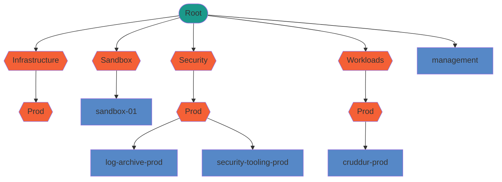

# Week 0 — Billing and Architecture

# AWS Setup

## AWS Organization Structure



### AWS CLI Commands for Setting up Organization

```bash
# Create organization
aws organizations create-organization

# Get Root Id
aws organizations list-roots --query Roots[0].Id --output text
# Create OUs
aws organizations create-organizational-unit --parent-id r-xxxx --name Security
aws organizations create-organizational-unit --parent-id ou-xxxx-yyyy --name Prod
# Create accounts
aws organizations create-account --email email@email.com --account-name log-archive-prod
# Move accounts to proper OU
aws organizations list-accounts
aws organizations move-account --account-id 222222222222 --source-parent-id r-xxxx --destination-parent-id ou-xxxx-yyyy
```

### SCPs

#### Deny Actions as a Root User

```json
{
    "Version": "2012-10-17",
    "Statement": [
        {
            "Sid": "DenyRootUserActions",
            "Effect": "Deny",
            "Action": "*",
            "Resource": "*",
            "Condition": {
                "StringLike": {
                    "aws:PrincipalArn": "arn:aws:iam::*:root"
                }
            }
        }
    ]
}
```

#### Deny Ability to Leave Organization

```json
{
    "Version": "2012-10-17",
    "Statement": [
        {
            "Sid": "DenyLeaveOrganization",
            "Effect": "Deny",
            "Action": "organizations:LeaveOrganization",
            "Resource": "*"
        }
    ]
}
```

#### Restrict Region to us-east-1

```json
{
    "Version": "2012-10-17",
    "Statement": [
        {
            "Sid": "RestrictRegion",
            "Effect": "Deny",
            "Action": "*",
            "Resource": "*",
            "Condition": {
                "StringNotEquals": {
                    "aws:RequestedRegion": [
                        "us-east-1"
                    ]
                }
            }
        }
    ]
}
```

#### Deny Ability to Delete Organization Trail KMS Key

```json
{
    "Version": "2012-10-17",
    "Statement": [
        {
            "Effect": "Deny",
            "Action": [
                "kms:ScheduleKeyDeletion",
                "kms:DisableKey"
            ],
            "Resource": "arn:aws:kms:us-east-1:123456789012:key/111-2222-3333-4444"
        }
    ]
}
```